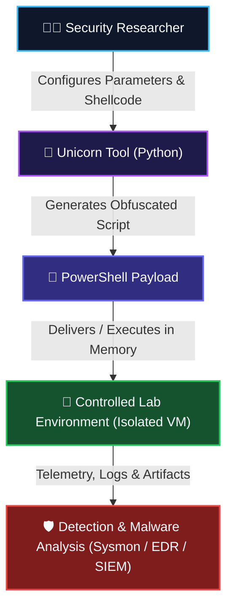

# 🦄 Unicorn — PowerShell Payload Generation & Malware Analysis Research

<div align="center">

[](https://python.org)
[](https://learn.microsoft.com/en-us/powershell/)
[](https://attack.mitre.org/techniques/T1059/001/)
[](#)
[](https://github.com/ishan-walia)

---

**`[ishan@secops:~/HTB/Python/File-Malware-Analysis/unicorn]#`**  
*Unicorn is a Python-based tool associated with PowerShell payload generation, obfuscation, and penetration-testing research. It is used in security labs to study how PowerShell-based payloads are generated, encoded, and delivered in controlled environments.*

</div>

---

> [!WARNING]
> **Legal & Ethical Disclaimer**: This project is intended for authorized security testing, malware-analysis research, and educational lab environments only. Do not use it against systems or networks without explicit written permission.

---

## 🔎 What is Unicorn?

**Unicorn** is an offensive-security framework and research tool that focuses on generating PowerShell-based payloads and integrating them into penetration-testing workflows.

It has historically been utilized by security researchers and penetration testers to investigate and understand:
- **PowerShell-based payloads**: Native Windows scripting execution mechanisms.
- **Payload generation & injection**: Converting shellcode into memory-injectable PowerShell routines.
- **Encoding & obfuscation concepts**: Base64 encoding and string obfuscation techniques.
- **Command execution techniques**: Invoking command-line switches such as `-NoP`, `-NonI`, `-W Hidden`, and `-Enc`.
- **Metasploit integration**: Generating compatible macro, HTA, and multi-handler stages.
- **Antivirus/EDR evasion research**: Studying how security products flag suspicious command lines and script block contents.
- **Post-exploitation concepts**: In-memory payload execution without writing binaries to disk (Living off the Land).

> [!NOTE]
> Unicorn is particularly valuable for learning how malicious PowerShell activity surfaces during an attack and how security analysts and defenders can effectively detect it.

---

## 🧠 How Unicorn Works — High Level

The primary security consideration is that **PowerShell** can be easily abused by threat actors because it is a legitimate, built-in administrative tool native to modern Windows operating systems.

### 🔄 Execution Flowchart



### 📋 High-Level Workflow Diagram

```text
┌─────────────────────────┐
│   Security Researcher   │
└────────────┬────────────┘
             │ Configures payload type & listener
             ▼
┌─────────────────────────┐
│      Unicorn Tool       │
└────────────┬────────────┘
             │ Generates encoded/obfuscated command
             ▼
┌─────────────────────────┐
│   PowerShell Payload    │
└────────────┬────────────┘
             │ Delivered to target endpoint
             ▼
┌─────────────────────────┐
│ Controlled Lab (Target) │
└────────────┬────────────┘
             │ Execution & behavioral telemetry
             ▼
┌─────────────────────────┐
│  Detection & Analysis   │
└─────────────────────────┘
```

---

## 🛡️ Why Study Unicorn?

Studying tools such as Unicorn helps cybersecurity students and professionals bridge the gap between offensive techniques and defensive engineering.

### ⚔️ Offensive Security Perspective
Unicorn demonstrates fundamental concepts related to:
- **PowerShell payloads**: Building stealthy execution vectors.
- **Payload encoding**: Understanding character set encodings (UTF-16LE, Base64).
- **Command execution**: Leveraging built-in Windows execution flags.
- **Metasploit workflows**: Handler automation and resource file scripting.
- **Post-exploitation research**: Memory-only delivery methods (*Living off the Land / Fileless attacks*).

### 🛡️ Defensive Security Perspective
From a blue team and detection perspective, studying these techniques empowers:
- **PowerShell monitoring**: Auditing Script Block Logging (Event ID 4104) and Transcription (Event ID 4100).
- **Malware analysis**: Reconstructing payloads and de-obfuscating encoded script blocks.
- **Endpoint Detection and Response (EDR)**: Writing behavioral indicators for parent-child process anomalies.
- **Incident Response**: Correlating endpoint events during triage.
- **Threat Hunting**: Proactively discovering unquoted or suspicious PowerShell execution strings.
- **SIEM detection rules**: Building alert correlation logic (Sigma, YARA-L, KQL).
- **Suspicious process analysis**: Tracking abnormal execution trees and command-line arguments.

---

## 🔬 Malware Analysis Perspective

When analyzing a Unicorn-generated payload in an isolated malware analysis environment, researchers apply both static and dynamic methods:

### 1. 🔍 Static Analysis (Inspection Without Execution)
Examine the payload file, script, or delivery carrier without running it:
- **File Type & Structure**: Identifying wrapper formats (e.g., `.bat`, `.vbs`, `.hta`, `.docm` macro).
- **Cryptographic Hashes**: Generating MD5, SHA-1, SHA-256 for identification and tracking.
- **Strings Extraction**: Identifying hardcoded URLs, IPs, registry keys, API calls, or base64 blobs.
- **Metadata Analysis**: Checking compiler/creation timestamps, author metadata, and encoding formats.
- **Embedded Scripts**: Extracting embedded PowerShell commands inside macro documents or batch files.
- **Encoded Content De-obfuscation**: Decoding Base64 strings (UTF-16LE) to reveal original underlying code.
- **Suspicious Indicators (IOCs)**: Looking for keywords such as `powershell.exe`, `DownloadString`, `FromBase64String`, `VirtualAlloc`, or `CreateThread`.

### 2. ⚡ Dynamic Analysis (Behavioral Execution in Sandbox)
Execute the sample exclusively inside a strictly isolated lab environment and monitor:
- **Process Creation**: Tracking spawned instances of `powershell.exe` or `cmd.exe`.
- **PowerShell Activity**: Intercepting executed script blocks and pipeline execution.
- **Network Connections**: Monitoring outbound HTTP/TCP callbacks, reverse-shell connections, or beaconing.
- **File-System Changes**: Observing artifacts written to `%TEMP%`, `%APPDATA%`, or startup paths.
- **Registry Activity**: Detecting changes to persistence keys (e.g., Run keys, ASEPs).
- **Child Processes**: Identifying if PowerShell spawns child utilities (`whoami.exe`, `net.exe`, `rundll32.exe`).
- **Persistence Attempts**: Reviewing scheduled task registration or service installations.

---

## 🧰 Related Security Concepts

Unicorn can be studied alongside several essential cybersecurity domains:

| Concept | Purpose / Role in Security |
| :--- | :--- |
| **PowerShell** | Legitimate Windows administration and scripting environment, often leveraged by dual-use tools. |
| **Metasploit** | Industry-standard penetration testing framework used for payload generation and handler orchestration. |
| **Payload** | Specialized code designed to execute on a target system to deliver shell access or run specific commands. |
| **Encoding** | Transforming data into another format (e.g., Base64, Hex) for transport compatibility or obfuscation. |
| **Obfuscation** | Modifying source code or binary structure to hinder human comprehension and static signature detection. |
| **EDR (Endpoint Detection & Response)** | Real-time endpoint monitoring and response tool looking for anomalous behavior and process anomalies. |
| **SIEM (Security Info & Event Mgmt)** | Centralized platform aggregating and correlating security logs for alerts and compliance. |
| **Threat Hunting** | Proactive, hypothesis-driven identification of malicious activities lingering within networks. |
| **Malware Analysis** | Deep-dive reverse engineering and triage to determine malware capabilities, origin, and impact. |

---

## 🚨 Detection Considerations & Indicators

Defenders should pay special attention to anomalies in PowerShell usage. Security operations centers (SOC) can detect Unicorn-like activity using distinct telemetry signals:

### ⚠️ Common Telemetry Indicators
- **Unusual PowerShell Execution**: High frequency of PowerShell executions on non-administrative user endpoints.
- **Encoded Commands**: Invocation of `-EncodedCommand` (`-enc`, `-e`) with long Base64 strings.
- **Unexpected Parent Processes**: `powershell.exe` spawned by `word.exe`, `excel.exe`, `mshta.exe`, `wscript.exe`, or `cscript.exe`.
- **Suspicious Process Arguments**: Combinations of flags like `-NoP -NonI -W Hidden -Exec Bypass`.
- **Network Initiation by Script Hosts**: Outbound connections originated directly by `powershell.exe` or `powershell_ise.exe`.
- **Download-and-Execute Cradles**: Utilization of `System.Net.WebClient`, `Invoke-WebRequest`, or `IEX` (`Invoke-Expression`).
- **Execution from Temp Directories**: Scripts running out of `AppData\Local\Temp` or non-standard paths.

### 🛠️ Defense & Monitoring Stack
Security teams can capture and correlate these events using:
- **Windows Event Logs**: Event ID 4688 (Process Creation with Command Line Auditing enabled).
- **PowerShell Logging**: Event ID 4104 (Script Block Logging) & Event ID 4103 (Module Logging).
- **Sysmon**: Event ID 1 (Process Create), Event ID 3 (Network Connect), Event ID 7 (Image Loaded).
- **EDR Solutions**: Behavioral rules detecting memory injection (e.g., `VirtualAllocEx`, `WriteProcessMemory`).
- **SIEM Platforms**: Correlation rules detecting living-off-the-land techniques (MITRE T1059.001).

---

## 🧪 Recommended Lab Environment

> [!CAUTION]
> **Safety Rule**: Never test malware or offensive payloads against systems that you do not own or lack explicit written authorization to test. Always use completely isolated virtual networks (Host-Only or Internal Network mode).

```text
┌────────────────────────────────────────────────────────┐
│                      Host Machine                      │
│                                                        │
│   ┌────────────────────┐      ┌────────────────────┐   │
│   │    Kali Linux      │      │     Windows VM     │   │
│   │  (Research / Gen)  │◄────►│  (Analysis / Lab)  │   │
│   └────────────────────┘      └────────────────────┘   │
│                                                        │
│           [ Isolated Host-Only Network Adapter ]       │
└────────────────────────────────────────────────────────┘
```

---

## 📚 Purpose of This Directory

This directory is an integral part of the cybersecurity research collection. Its primary objectives are:
1. **Documenting Unicorn**: Clarifying its role, functionality, and payload delivery mechanics.
2. **PowerShell Security Research**: Understanding how script engines interact with memory and host security layers.
3. **Malware Analysis Concepts**: Documenting practical static and dynamic analysis workflows.
4. **Offensive Knowledge for Better Defense**: Examining high-level offensive techniques to build resilient detection systems.
5. **Actionable Blue Team Insights**: Cataloging concrete indicators, log sources, and SIEM/Sysmon detection opportunities.

---

## ⚠️ Disclaimer

This repository is created exclusively for educational and authorized cybersecurity research purposes. The author does not condone or encourage:
- Unauthorized access or unauthorized network scanning.
- Deployment of malware against production or unauthorized systems.
- Credential harvesting, unauthorized data exfiltration, or data destruction.
- Bypassing security controls on systems without prior written authorization.

*Always utilize properly configured, air-gapped or host-only lab environments when conducting research.*

---

## 👨‍💻 Author

**Ishan Walia**  
*Cybersecurity Student | Python | Flutter | Ethical Hacking | Malware Analysis*  
GitHub: [@ishan-walia](https://github.com/ishan-walia)

---

## 📌 References

- [MITRE ATT&CK — Command and Scripting Interpreter: PowerShell (T1059.001)](https://attack.mitre.org/techniques/T1059/001/)
- [Microsoft Learn — PowerShell Security Documentation](https://learn.microsoft.com/en-us/powershell/scripting/security/overview)
- [Microsoft Sysmon Documentation](https://learn.microsoft.com/en-us/sysinternals/downloads/sysmon)
- [Metasploit Framework Documentation](https://docs.metasploit.com/)
- [TrustedSec — Magic Unicorn Tool Repository](https://github.com/trustedsec/unicorn)
