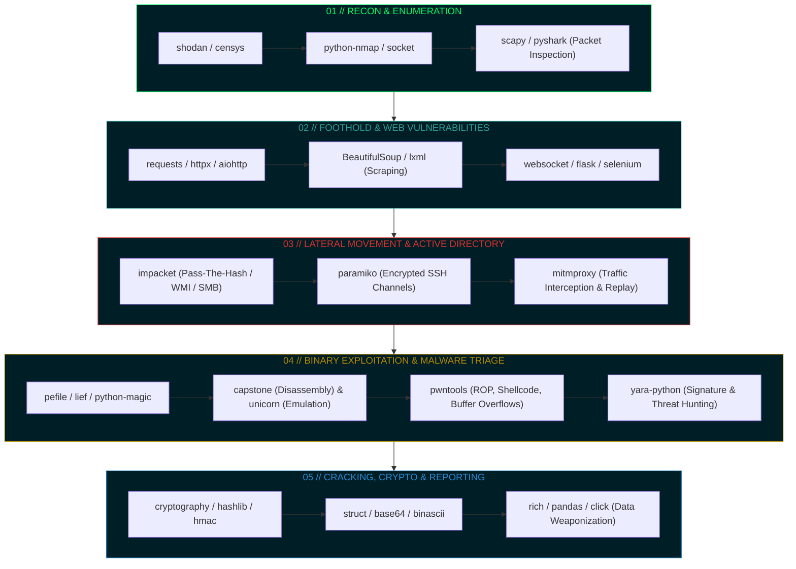

# 💀 HTB // PYTHON OFFENSIVE & DEFENSIVE ARSENAL

```text
 _________________________________________________________________________________________
|  _____________________________________________________________________________________  |
| | [!] SEC-OPS INTELLIGENCE REPOSITORY: WEAPONIZED PYTHON FRAMEWORKS                  | |
| |                                                                                     | |
| |    _   _ _____ ____    ______   _______ _   _  ___  _   _                           | |
| |   | | | |_   _| __ )  |  _ \ \ / /_   _| | | |/ _ \| \ | |                          | |
| |   | |_| | | | |  _ \  | |_) \ V /  | | | |_| | | | |  \| |                          | |
| |   |  _  | | | | |_) | |  __/ | |   | | |  _  | |_| | |\  |                          | |
| |   |_| |_| |_| |____/  |_|    |_|   |_| |_| |_|\___/|_| \_|                          | |
| |                                                                                     | |
| | [*] RECONNAISSANCE | EXPLOIT DEV | REVERSE ENGINEERING | ACTIVE DIRECTORY           | |
| | [*] TARGET MATRIX  : HACK THE BOX, CTF ARENAS & ENTERPRISE RED TEAM LABS            | |
| | [*] OPERATOR       : ISHAN WALIA                                                    | |
| | [*] SYSTEM STATUS  : [ ARMED & READY ]                                              | |
| |_____________________________________________________________________________________| |
|_________________________________________________________________________________________|
```

<div align="center">

[](https://hackthebox.com)
[](https://python.org)
[](https://kali.org)
[](#)
[](#)
[](#)

---

**`[ishan@secops:~/HTB/Python]#`** *A master collection of categorized Python libraries, offensive scripts, reverse engineering toolchains, and post-exploitation modules engineered for solving complex HackTheBox machines and security challenges.*

</div>

---

## ⚡ Attack Kill-Chain & Architecture Pipeline



---

## 🗄️ Full Arsenal Directory Tree

```text
Python/
├── 📡 Networking-Recon/       # Low-level socket scanners, packet engines, OSINT
├── 🌐 Web-Security/           # HTTP weaponization, SSRF/CSRF, API exploitation
├── 🔬 File-Malware-Analysis/  # ELF/PE disassemblers, emulators, YARA rules
├── 🔐 Cryptography-Data/      # Ciphers, hash identification, byte packing
├── ⚙️ System-Automation/      # Terminal shells, subprocessing, rich CLI telemetry
└── ⚔️ Advanced-Security/      # Active Directory (impacket), pwn, SSH conduits
```

---

## 🛠️ Weaponized Module Matrix & Core Toolkits

### 1. 📡 [Networking-Recon](file:///d:/Cyber%20Security%20Projects/HTB-Writeups-and-Research/Python/Networking-Recon)
> *Low-level network scanning, custom protocol crafting, and OSINT reconnaissance.*

| Module | Classification | Cyber Security & HTB Usage |
| :--- | :--- | :--- |
| [`scapy`](file:///d:/Cyber%20Security%20Projects/HTB-Writeups-and-Research/Python/Networking-Recon/scapy) | Packet Crafting | Custom ARP spoofing, TCP SYN scanning, DNS tunnel injection. |
| [`python-nmap`](file:///d:/Cyber%20Security%20Projects/HTB-Writeups-and-Research/Python/Networking-Recon/python-nmap) | Network Auditing | Programmatic port scanning & service banner fingerprinting. |
| [`shodan`](file:///d:/Cyber%20Security%20Projects/HTB-Writeups-and-Research/Python/Networking-Recon/shodan) | Internet OSINT | Identifying vulnerable exposed IoT devices, ICS, and open C2s. |
| [`censys`](file:///d:/Cyber%20Security%20Projects/HTB-Writeups-and-Research/Python/Networking-Recon/censys) | Attack Surface | Certificate transparency logs, domain and sub-asset mapping. |
| [`socket`](file:///d:/Cyber%20Security%20Projects/HTB-Writeups-and-Research/Python/Networking-Recon/socket) | Core Transport | Raw TCP/UDP socket reverse shells, banners, listener engines. |
| [`pyshark`](file:///d:/Cyber%20Security%20Projects/HTB-Writeups-and-Research/Python/Networking-Recon/pyshark) | PCAP Analysis | Python Wireshark parser for credential extraction from `.pcap`. |
| [`dnspython`](file:///d:/Cyber%20Security%20Projects/HTB-Writeups-and-Research/Python/Networking-Recon/dnspython) | DNS Exploits | Zone transfers (`AXFR`), subdomain brute-forcing, SRV checks. |
| [`netaddr`](file:///d:/Cyber%20Security%20Projects/HTB-Writeups-and-Research/Python/Networking-Recon/netaddr) | Subnet Routing | CIDR range enumeration, IP range validation, broadcast pivots. |
| [`python-whois`](file:///d:/Cyber%20Security%20Projects/HTB-Writeups-and-Research/Python/Networking-Recon/python-whois) | Domain OSINT | Registrant tracking, ASN attribution, name server mapping. |

---

### 2. 🌐 [Web-Security](file:///d:/Cyber%20Security%20Projects/HTB-Writeups-and-Research/Python/Web-Security)
> *Custom fuzzing engines, authentication brute-forcers, and headless exploit pipelines.*

| Module | Classification | Cyber Security & HTB Usage |
| :--- | :--- | :--- |
| [`requests`](file:///d:/Cyber%20Security%20Projects/HTB-Writeups-and-Research/Python/Web-Security/requests) | HTTP Engine | Custom headers, session hijacking, cookie replay, SSRF automation. |
| [`httpx`](file:///d:/Cyber%20Security%20Projects/HTB-Writeups-and-Research/Python/Web-Security/httpx) | HTTP/2 & Async | High-speed concurrent directory & parameter brute-forcing. |
| [`aiohttp`](file:///d:/Cyber%20Security%20Projects/HTB-Writeups-and-Research/Python/Web-Security/aiohttp) | Asynchronous | Blazing-fast asynchronous fuzzers (10,000+ requests/sec). |
| [`BeautifulSoup`](file:///d:/Cyber%20Security%20Projects/HTB-Writeups-and-Research/Python/Web-Security/BeautifulSoup) | DOM Parser | Scrapes hidden tokens, CSRF values, sensitive comments in HTML. |
| [`lxml`](file:///d:/Cyber%20Security%20Projects/HTB-Writeups-and-Research/Python/Web-Security/lxml) | XML Parsing | High-speed XML/XPath parsing, XXE vulnerability testing. |
| [`websocket-client`](file:///d:/Cyber%20Security%20Projects/HTB-Writeups-and-Research/Python/Web-Security/websocket-client) | Socket Stream | Exploiting real-time web chat sockets, blind SQLi over WS. |
| [`selenium`](file:///d:/Cyber%20Security%20Projects/HTB-Writeups-and-Research/Python/Web-Security/selenium) | Browser Driver | XSS victim simulation, bypass complex Cloudflare/JS challenges. |
| [`flask`](file:///d:/Cyber%20Security%20Projects/HTB-Writeups-and-Research/Python/Web-Security/flask) | Web Mock / C2 | Lightweight C2 catchers, phishing landing pages, webhook hooks. |

---

### 3. 🔬 [File-Malware-Analysis](file:///d:/Cyber%20Security%20Projects/HTB-Writeups-and-Research/Python/File-Malware-Analysis)
> *Binary inspection, static/dynamic reverse engineering, and signature hunting.*

| Module | Classification | Cyber Security & HTB Usage |
| :--- | :--- | :--- |
| [`pefile`](file:///d:/Cyber%20Security%20Projects/HTB-Writeups-and-Research/Python/File-Malware-Analysis/pefile) | Windows PE | Parse headers, sections (`.text`, `.rdata`), IAT/EAT suspicious hooks. |
| [`yara-python`](file:///d:/Cyber%20Security%20Projects/HTB-Writeups-and-Research/Python/File-Malware-Analysis/yara-python) | Threat Hunting | Match malware signatures, ransomware strings, detect webshells. |
| [`capstone`](file:///d:/Cyber%20Security%20Projects/HTB-Writeups-and-Research/Python/File-Malware-Analysis/capstone) | Disassembler | Disassemble x86/x64/ARM binary machine code to assembly instructions. |
| [`unicorn`](file:///d:/Cyber%20Security%20Projects/HTB-Writeups-and-Research/Python/File-Malware-Analysis/unicorn) | CPU Emulator | Emulate obfuscated shellcode in a safe sandbox without execution. |
| [`lief`](file:///d:/Cyber%20Security%20Projects/HTB-Writeups-and-Research/Python/File-Malware-Analysis/lief) | Executable Mod | Instrumenting ELF/PE/Mach-O binaries, injecting hooks into headers. |
| [`python-magic`](file:///d:/Cyber%20Security%20Projects/HTB-Writeups-and-Research/Python/File-Malware-Analysis/python-magic) | File Signatures | Identifying true MIME types by magic bytes (defeats extension spoofing). |
| [`zipfile`](file:///d:/Cyber%20Security%20Projects/HTB-Writeups-and-Research/Python/File-Malware-Analysis/zipfile) | Compressed Formats | Zip-bomb analysis, automated password brute-forcing of archives. |

---

### 4. 🔐 [Cryptography-Data](file:///d:/Cyber%20Security%20Projects/HTB-Writeups-and-Research/Python/Cryptography-Data)
> *Cryptographic cracking, binary marshalling, and token exploitation.*

| Module | Classification | Cyber Security & HTB Usage |
| :--- | :--- | :--- |
| [`cryptography`](file:///d:/Cyber%20Security%20Projects/HTB-Writeups-and-Research/Python/Cryptography-Data/cryptography) | Encryption Suite | AES-CBC/GCM, RSA key generation, padding oracle attack tools. |
| [`hashlib`](file:///d:/Cyber%20Security%20Projects/HTB-Writeups-and-Research/Python/Cryptography-Data/hashlib) | Hashing | MD5/SHA-256 hash generators, rainbow table lookups, password crackers. |
| [`hmac`](file:///d:/Cyber%20Security%20Projects/HTB-Writeups-and-Research/Python/Cryptography-Data/hmac) | Message Integrity | Validating & forging HMAC tokens, timing attack exploit tests. |
| [`struct`](file:///d:/Cyber%20Security%20Projects/HTB-Writeups-and-Research/Python/Cryptography-Data/struct) | Byte Packing | Packing little-endian memory addresses (`struct.pack("<I", 0x08048000)`). |
| [`base64`](file:///d:/Cyber%20Security%20Projects/HTB-Writeups-and-Research/Python/Cryptography-Data/base64) | Encoders | Encoding payloads for command injection, decoding JWT tokens. |
| [`binascii`](file:///d:/Cyber%20Security%20Projects/HTB-Writeups-and-Research/Python/Cryptography-Data/binascii) | Hex Operations | Raw hex to binary conversions, CRC32 collision calculation. |
| [`secrets`](file:///d:/Cyber%20Security%20Projects/HTB-Writeups-and-Research/Python/Cryptography-Data/secrets) | CSPRNG | Cryptographically secure pseudo-random entropy generation. |

---

### 5. ⚔️ [Advanced-Security](file:///d:/Cyber%20Security%20Projects/HTB-Writeups-and-Research/Python/Advanced-Security)
> *Heavy-duty penetration testing tools, Active Directory abuse, and binary exploitation.*

| Module | Classification | Cyber Security & HTB Usage |
| :--- | :--- | :--- |
| [`pwntools`](file:///d:/Cyber%20Security%20Projects/HTB-Writeups-and-Research/Python/Advanced-Security/pwntools) | Binary Exploit | ROP chains, shellcode generation, cyclic patterns, format strings. |
| [`impacket`](file:///d:/Cyber%20Security%20Projects/HTB-Writeups-and-Research/Python/Advanced-Security/impacket) | Active Directory | Kerberoasting, SecretsDump, SMBExec, Pass-The-Hash attacks. |
| [`paramiko`](file:///d:/Cyber%20Security%20Projects/HTB-Writeups-and-Research/Python/Advanced-Security/paramiko) | SSH Protocol | Automated SSH brute-forcing, persistent backdoors, port forwarding. |
| [`mitmproxy`](file:///d:/Cyber%20Security%20Projects/HTB-Writeups-and-Research/Python/Advanced-Security/mitmproxy) | Interceptor | Scriptable HTTP/HTTPS proxy for on-the-fly traffic tampering. |
| [`pandas`](file:///d:/Cyber%20Security%20Projects/HTB-Writeups-and-Research/Python/Advanced-Security/pandas) | Threat Intel | Processing massive breach datasets, analyzing log telemetry. |

---

### 6. ⚙️ [System-Automation](file:///d:/Cyber%20Security%20Projects/HTB-Writeups-and-Research/Python/System-Automation)
> *Interactive terminals, privilege escalation telemetry, and agent scripting.*

| Module | Classification | Cyber Security & HTB Usage |
| :--- | :--- | :--- |
| [`os`](file:///d:/Cyber%20Security%20Projects/HTB-Writeups-and-Research/Python/System-Automation/os) & [`subprocess`](file:///d:/Cyber%20Security%20Projects/HTB-Writeups-and-Research/Python/System-Automation/subprocess) | Core Shell | Spawning shells, executing system binaries, reading `/etc/passwd`. |
| [`psutil`](file:///d:/Cyber%20Security%20Projects/HTB-Writeups-and-Research/Python/System-Automation/psutil) | Process Monitor | Hunting for unquoted service paths, monitoring active PIDs. |
| [`click`](file:///d:/Cyber%20Security%20Projects/HTB-Writeups-and-Research/Python/System-Automation/click) | CLI Engine | Building professional command-line security tools with flags. |
| [`rich`](file:///d:/Cyber%20Security%20Projects/HTB-Writeups-and-Research/Python/System-Automation/rich) & [`colorama`](file:///d:/Cyber%20Security%20Projects/HTB-Writeups-and-Research/Python/System-Automation/colorama) | Terminal UI | Beautiful colored tables, progress bars, hacker UI dashboards. |

---

## 💻 Elite Terminal Field Examples

### 🎯 1. Pwntools: Remote ROP & Shellcode Delivery
```python
from pwn import *

context(arch='amd64', os='linux')
target = remote('10.10.11.234', 1337)

# Generate cyclic offset and send exploit payload
offset = 72
payload = flat({
    offset: [
        0x00000000004011cb, # pop rdi; ret
        0x0000000000404028, # pointer to /bin/sh
        0x0000000000401030  # system() PLT
    ]
})

target.sendline(payload)
target.interactive()
```

### 🛰️ 2. Scapy: Stealth TCP SYN Scanner
```python
from scapy.all import IP, TCP, sr1

ip = "10.10.11.100"
port = 445

# Craft stealth SYN packet
packet = IP(dst=ip) / TCP(dport=port, flags="S")
response = sr1(packet, timeout=1, verbose=0)

if response and response.haslayer(TCP):
    if response[TCP].flags == 0x12: # SYN-ACK detected
        print(f"[+] PORT {port} IS OPEN (Vulnerable SMB)")
```

### 🔑 3. Impacket: Pass-The-Hash Credential Extraction
```python
from impacket.examples.secretsdump import LocalOperations, RemoteOperations

# Ingest SAM/SYSTEM hives to dump hashes offline
print("[*] Parsing NTDS.dit and LSA Secrets via Impacket...")
# Live execution handled through impacket toolkit
```

---

## 🚀 Quick Setup & Arsenal Activation

Run these commands inside your Kali Linux or virtual environment to arm your workspace:

```bash
# 1. Create a dedicated isolated security virtualenv
python3 -m venv htb-venv
source htb-venv/bin/activate  # On Windows: .\htb-venv\Scripts\Activate.ps1

# 2. Upgrade pip and core tooling
pip install --upgrade pip setuptools wheel

# 3. Mass-install the offensive arsenal
pip install pwntools scapy impacket paramiko requests httpx aiohttp \
            beautifulsoup4 pefile yara-python capstone unicorn lief \
            cryptography rich click psutil netaddr dnspython
```

---

## 🎯 HTB Machine Workflow Mapping

```text
┌──────────────────────────────────────────────────────────────┐
│  [+] STEP 1: Reconnaissance (shodan, python-nmap, socket)    │
│  [+] STEP 2: Web Exploitation (requests, httpx, bs4, lxml)   │
│  [+] STEP 3: Initial Shell (pwntools, socket, subprocess)    │
│  [+] STEP 4: Privilege Escalation (psutil, pefile, lief)     │
│  [+] STEP 5: Domain Dominance (impacket, paramiko)           │
└──────────────────────────────────────────────────────────────┘
```

---

## 🛡️ Responsible Disclosure & Legal Disclaimer

> [!CAUTION]
> **STRICTLY FOR ETHICAL SECURITY RESEARCH & AUTHORIZED PENETRATION TESTING:**
> The code, documentation, and tools included in this repository are intended solely for educational exercises on authorized platforms (e.g., **Hack The Box, TryHackMe, Proving Grounds**) or internal security assessments with explicit written authorization. Unauthorized access against computer systems is illegal under national and international cybercrime legislation.

---

<div align="center">

**🔥 Maintained by Ishan Walia**  
*Hack The Box Researcher • Offensive Security Specialist • Cyber SecOps*  
`[ 0x00 // READY FOR COMPROMISE // ROOT@KALI ]`

</div>
